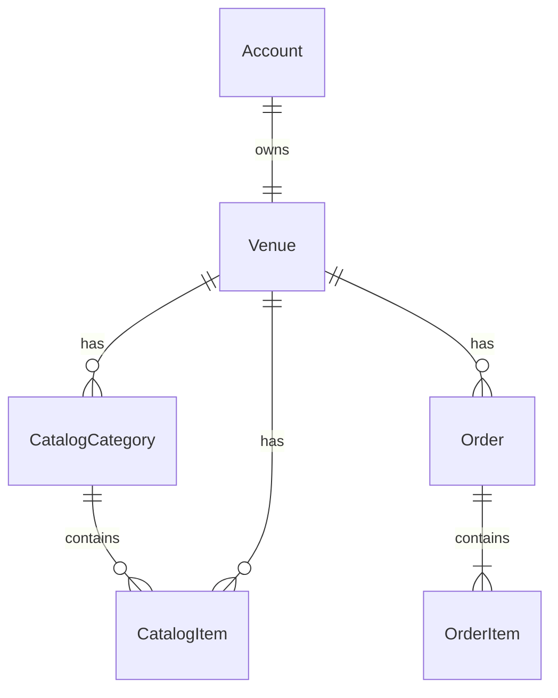

# Modelo de dados

Convenções: UUID interno; `slug` kebab-case único; `public_id` string opaca 10–16 chars; timestamps UTC; dinheiro em **centavos** (`price_cents`).

## Entidades — fatia 1 (cardápio)

### Account

Login do dono.

- `id`, `email` UNIQUE, `password_hash`, `created_at`

### Venue

- `id`, `owner_account_id` → Account
- `name`, `slug` UNIQUE, `public_id` UNIQUE
- `subscription_status`: `trial` | `active` | `past_due` | `suspended`
- `accepts_orders`: bool (**false** enquanto o cliente não pede pelo slug)
- `created_at`, `updated_at`

Um account possui **um** venue no plano Bar (1:1). `VenueMember` entra quando houver staff.

### Cardápio

- **CatalogCategory** — `venue_id`, `name`, `sort_order`, `active`, timestamps
- **CatalogItem**
  - `venue_id`, `category_id`, `name`, `description`, `image_url` (http(s) ou `/v1/uploads/{uuid}.ext`)
  - `price_cents`, `sort_order`, `active`, `max_note_length` (default 80; UI na fatia pedido guest)

## Entidades — fatia 2 (pedidos)

### Order

- `id`, `venue_id`
- `status`: `pending` | `accepted` | `preparing` | `delivered` | `cancelled`
- `source`: `counter` | `guest` (`guest` reservado; fatia 2 só `counter`)
- `table_label` (ex. "Mesa 4", "Balcão")
- `note`
- timestamps

### OrderItem

- `id`, `order_id`, `venue_id`
- `catalog_item_id` (nullable se o item do cardápio for apagado)
- `name_snapshot`, `unit_price_cents_snapshot`, `qty`, `note`

## Entidades — planejadas

- **PlatformUser** — operador EaiMesa
- **VenueMember** — `user_id`, `venue_id`, `role`: `owner` | `staff`
- **Table** — `id`, `venue_id`, `label`, `sort_order`, `active`
- **Tab** — `status`: `open` | `locked` | `closed`; `pin_hash`
- **TableClaim** — `token_hash`, TTL, uso único
- **GuestSession** — `tab_id`, `expires_at`
- **AuditLog** — `venue_id`, `actor_type`, `actor_id`, `action`, `metadata_json`

## Índices críticos

- `venues(slug)` UNIQUE
- `venues(public_id)` UNIQUE
- `accounts(email)` UNIQUE
- `catalog_categories(venue_id, sort_order)`
- `catalog_items(venue_id, category_id)`
- `orders(venue_id, status, created_at)`
- `order_items(order_id)`

## Regras de negócio

1. CRUD de catálogo e pedidos só com `venue_id` da sessão do dono.
2. Menu público: `active = true` em categoria e item.
3. DELETE categoria com itens → `CATEGORY_NOT_EMPTY`.
4. `OrderItem` sempre grava snapshot de preço/nome; o cliente **não** envia preço.
5. Pedido público pelo slug **não** existe nesta fatia.
6. Fechar tab (futuro) → revoke sessions + claims pendentes.

## Diagrama ER

## Postgres RLS (recomendado fase 1.5)

Política por `venue_id` em tabelas operacionais quando usar connection pool com `SET app.venue_id`.
