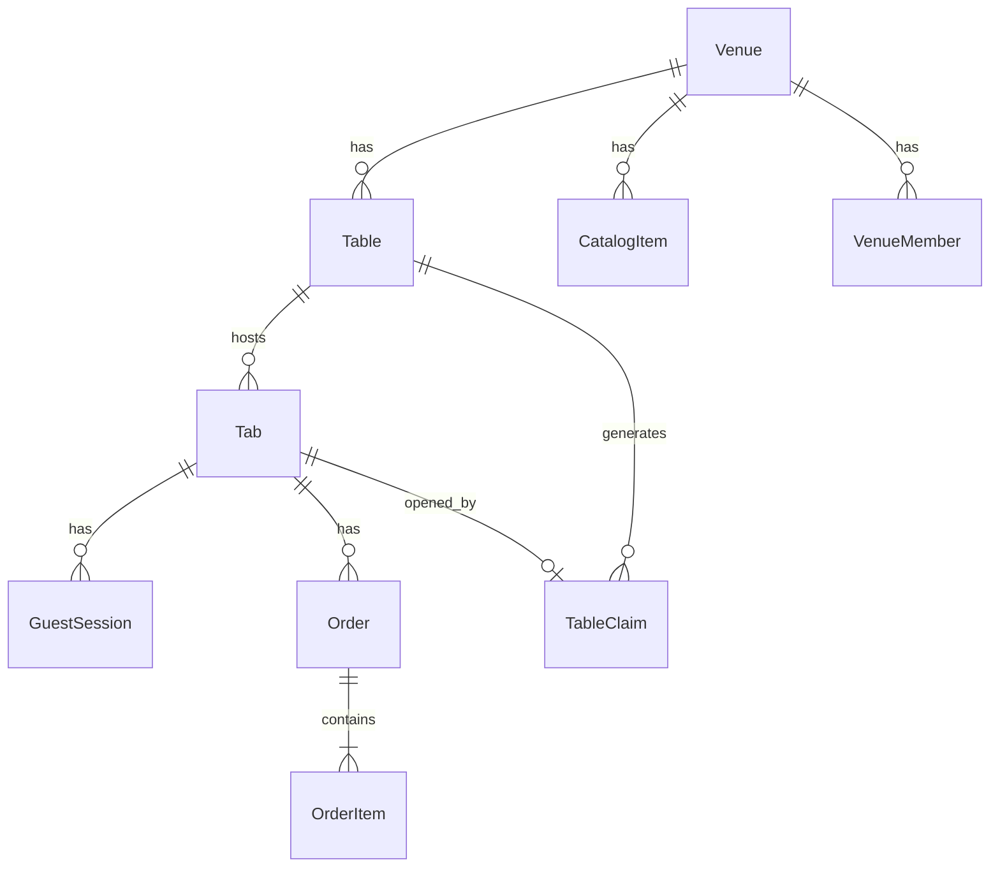

# Modelo de dados

Convenções: UUID interno; `venue_public_id` string opaca 10–16 chars; timestamps UTC.

## Entidades

### Platform (futuro próximo)

- **Account** — login do dono (e-mail, hash senha, 2FA opt).
- **PlatformUser** — operador EaiMesa.

### Tenant

- **Venue**
  - `id`, `public_id`, `name`, `slug_display?`
  - `subscription_status`: `trial` | `active` | `past_due` | `suspended`
  - `accepts_orders`: bool
  - `created_at`

- **VenueMember** — `user_id`, `venue_id`, `role`: `owner` | `staff`

- **Table**
  - `id`, `venue_id`, `label` (ex. "Mesa 4"), `sort_order`, `active`

### Cardápio

- **CatalogCategory** — `venue_id`, `name`, `sort_order`, `active`
- **CatalogItem**
  - `venue_id`, `category_id`, `name`, `description`, `price_cents`
  - `active`, `max_note_length`

### Comanda

- **Tab**
  - `venue_id`, `table_id`
  - `status`: `open` | `locked` | `closed`
  - `pin_hash` (4 dígitos, hash)
  - `opened_at`, `closed_at`

- **TableClaim**
  - `venue_id`, `table_id`, `staff_user_id`
  - `token_hash`, `expires_at`, `redeemed_at?`, `revoked_at?`
  - `tab_id?` (preenchido no redeem)

- **GuestSession**
  - `tab_id`, `device_fingerprint?`, `expires_at`, `revoked_at?`

### Pedidos

- **Order**
  - `tab_id`, `venue_id`, `status`: `pending` | `accepted` | `preparing` | `delivered` | `cancelled`
  - `idempotency_key`, `guest_session_id`, `note?`

- **OrderItem**
  - `order_id`, `catalog_item_id`, `name_snapshot`, `unit_price_cents_snapshot`, `qty`

### Auditoria

- **AuditLog**
  - `venue_id`, `actor_type`, `actor_id`, `action`, `metadata_json`, `created_at`

## Índices críticos

- `venue(public_id)` UNIQUE
- `tab(venue_id, table_id, status)` WHERE status = 'open' — no máximo 1 tab open/mesa (regra app)
- `table_claim(token_hash)` UNIQUE
- `guest_session(id)` + lookup por tab

## Regras de negócio (DB + app)

1. Fechar tab → revoke sessions + claims pendentes da tab.
2. Novo claim na mesa → revoke claims não usados anteriores dessa mesa.
3. `OrderItem` sempre grava snapshot de preço/nome.

## Diagrama ER (simplificado)

## Postgres RLS (recomendado fase 1.5)

Política por `venue_id` em tabelas operacionais quando usar connection pool com `SET app.venue_id`.
