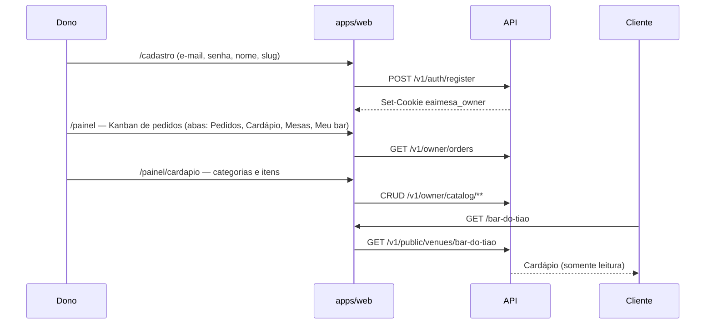
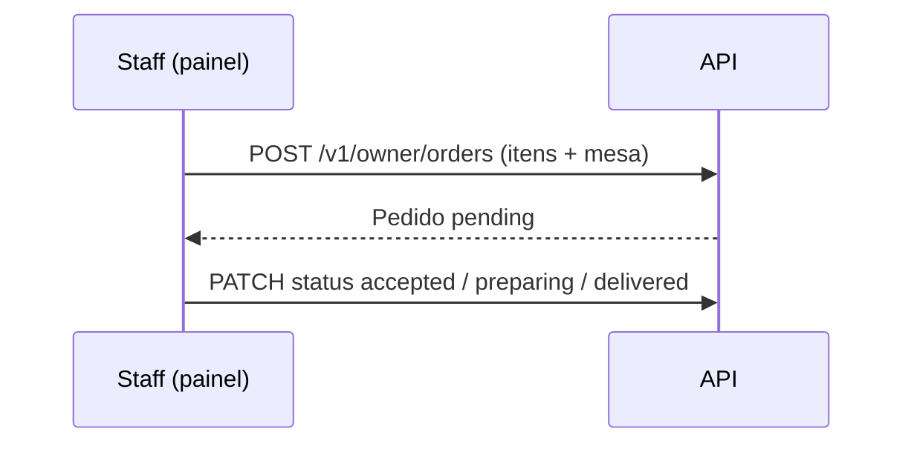
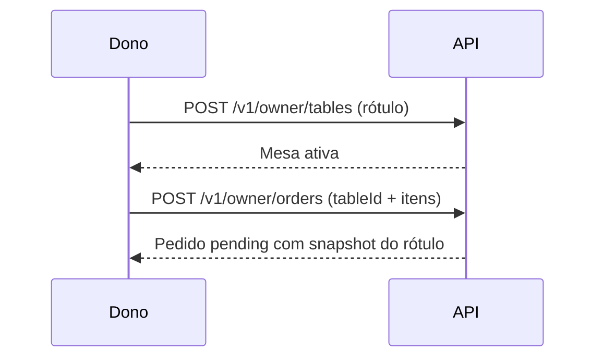
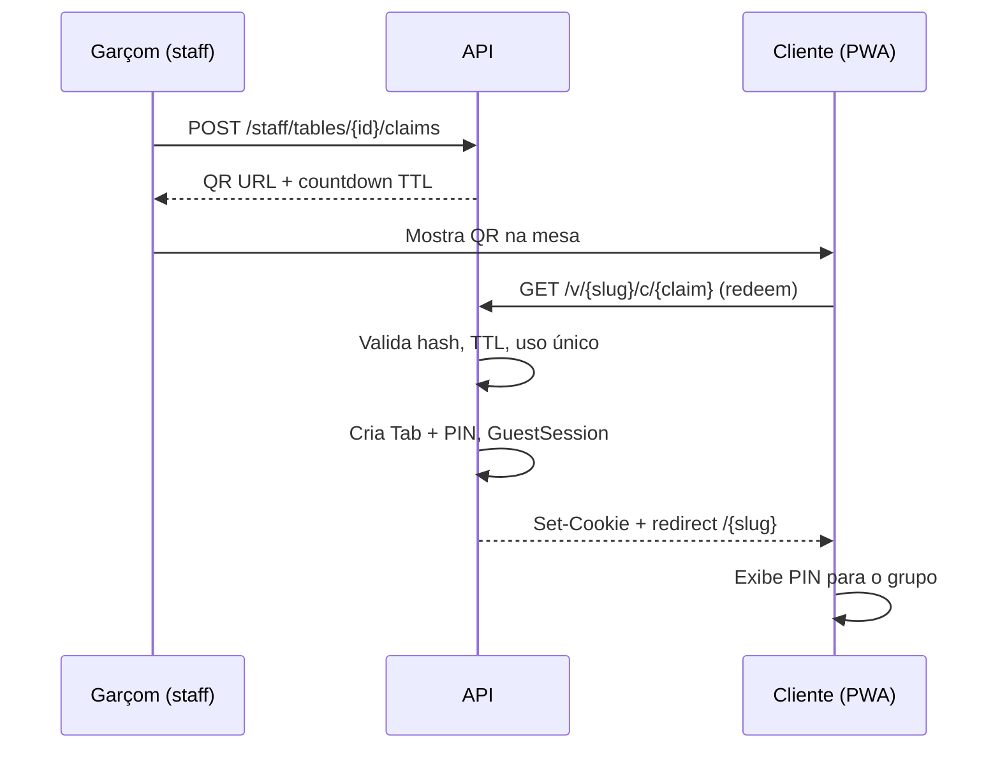

# Fluxos

## 0. Fatia 1 — publicar e ler o cardápio

Detalhe em [fatia-01-cardapio.md](fatia-01-cardapio.md).

1. Dono cria conta + venue (nome + slug único).
2. Monta categorias e itens (preço em centavos no servidor).
3. Comparte `https://eaimesa.com.br/{slug}` (QR, Instagram, balcão).
4. Cliente abre `/{slug}`: navega por **grupos**, toca o item para ver **foto** e descrição. **Não pede pelo link** (claim futuro). Pedidos de balcão: `/painel/pedidos`. Mesas: `/painel/mesas`.

## 0b. Fatia 2 — fila Kanban (balcão)

Detalhe em [fatia-02-pedidos.md](fatia-02-pedidos.md). O cliente **ainda não** pede pelo slug.

1. Staff entra (`/login`) e cai em `/painel/pedidos` (ou clica a aba **Pedidos**).
2. Lança pedido de balcão (escolhe a **mesa** cadastrada) ou vê os do seed.
3. Avança o card nas colunas até **Entregues**.

## 0c. Fatia 3 — cadastrar o salão

Detalhe em [fatia-03-mesas.md](fatia-03-mesas.md). Claim por mesa continua **fora**.

1. Dono abre **Mesas** e cadastra até 15 ativas (ex. Balcão, Mesa 1…10).
2. No Kanban, o pedido de balcão escolhe uma mesa ativa.
3. QR/claim por mesa entra na fatia seguinte.

## 1. Onboarding do bar (B2B)

1. Dono cria conta (e-mail + senha).
2. Cadastra venue: nome e **slug** (`bar-do-tiao`). CNPJ, CPF responsável e OTP entram em fatia posterior.
3. Escolhe plano Bar; gateway marca `subscription_status = active` (fatia billing). Na fatia 1 o seed/cadastro fica em `trial`.
4. Sistema gera `public_id` opaco interno; a URL pública é o slug.
5. Dono cadastra cardápio (fatia 1), fila (fatia 2) e mesas (fatia 3).
6. Divulga `/{slug}` — **não** o claim.

## 2. Abertura da mesa (garçom → cliente)

*Fatia futura.*

## 3. Outros celulares na mesa

*Fatia futura.*

1. Cliente abre `/{slug}`.
2. Tab já aberta → pede **PIN** (4 dígitos).
3. PIN correto → nova `GuestSession` na mesma `Tab`.
4. Garçom **não** precisa voltar.

## 4. Pedido

*Fatia futura.*

1. Guest autenticado monta carrinho (`itemId`, `qty`, `note` opcional).
2. `POST /guest/orders` com `Idempotency-Key`.
3. API calcula preço pelo catálogo do **venue da sessão**.
4. Pedido entra na fila staff: `pending` → `accepted` → `preparing` → `delivered`.
5. MVP: staff pode aceitar direto (sem “confirmar mesa vazia” — garçom já gerou claim).

## 5. Fechamento

*Fatia futura.*

1. Staff/caixa: `POST /staff/tabs/{id}/close`.
2. Tab → `closed`; revoga cookies e claims pendentes da tab.
3. Próxima rodada na mesa = **novo claim**.

## 6. Venue suspenso (billing)

- `GET /{slug}` → cardápio + aviso “assinatura inativa”.
- `POST /guest/orders` → **402/403**.
- Tabs abertas ainda podem **fechar**.

Na fatia 1, `suspended` ainda mostra o cardápio (read-only) com aviso, se o status estiver setado.

## Estados da Tab

*Fatia futura.*

| Estado | Guest | Staff |
|--------|-------|-------|
| `open` | Pede | Normal |
| `locked` | Só leitura ou 403 | Travada (QR vazou) |
| `closed` | Redirect / nova visita | Arquivo |

## Impressora (fase 2)

Após `accepted`, job `print_pending` para agente local do venue. Falha de print **não** cancela pedido — fila na tela permanece.
