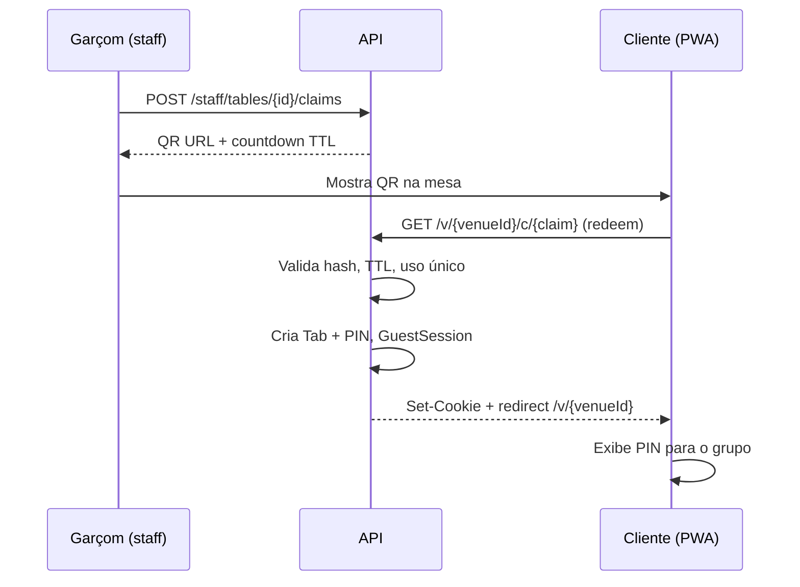

# Fluxos

## 1. Onboarding do bar (B2B)

1. Dono cria conta (e-mail + senha ou magic link).
2. Cadastra venue: nome, CNPJ, CPF responsável, celular OTP.
3. Escolhe plano Bar; gateway marca `subscription_status = active`.
4. Sistema gera `venue_public_id` opaco (ex. `d1de031d33`).
5. Dono cadastra mesas (Mesa 1…10) e cardápio.
6. Imprime/linka código da casa na porta/Instagram — **não** o claim.

## 2. Abertura da mesa (garçom → cliente)

## 3. Outros celulares na mesa

1. Cliente abre `/{venuePublicId}`.
2. Tab já aberta → pede **PIN** (4 dígitos).
3. PIN correto → nova `GuestSession` na mesma `Tab`.
4. Garçom **não** precisa voltar.

## 4. Pedido

1. Guest autenticado monta carrinho (`itemId`, `qty`, `note` opcional).
2. `POST /guest/orders` com `Idempotency-Key`.
3. API calcula preço pelo catálogo do **venue da sessão**.
4. Pedido entra na fila staff: `pending` → `accepted` → `preparing` → `delivered`.
5. MVP: staff pode aceitar direto (sem “confirmar mesa vazia” — garçom já gerou claim).

## 5. Fechamento

1. Staff/caixa: `POST /staff/tabs/{id}/close`.
2. Tab → `closed`; revoga cookies e claims pendentes da tab.
3. Próxima rodada na mesa = **novo claim**.

## 6. Venue suspenso (billing)

- `GET /{venuePublicId}` → cardápio + aviso “assinatura inativa”.
- `POST /guest/orders` → **402/403**.
- Tabs abertas ainda podem **fechar**.

## Estados da Tab

| Estado | Guest | Staff |
|--------|-------|-------|
| `open` | Pede | Normal |
| `locked` | Só leitura ou 403 | Travada (QR vazou) |
| `closed` | Redirect / nova visita | Arquivo |

## Impressora (fase 2)

Após `accepted`, job `print_pending` para agente local do venue. Falha de print **não** cancela pedido — fila na tela permanece.
