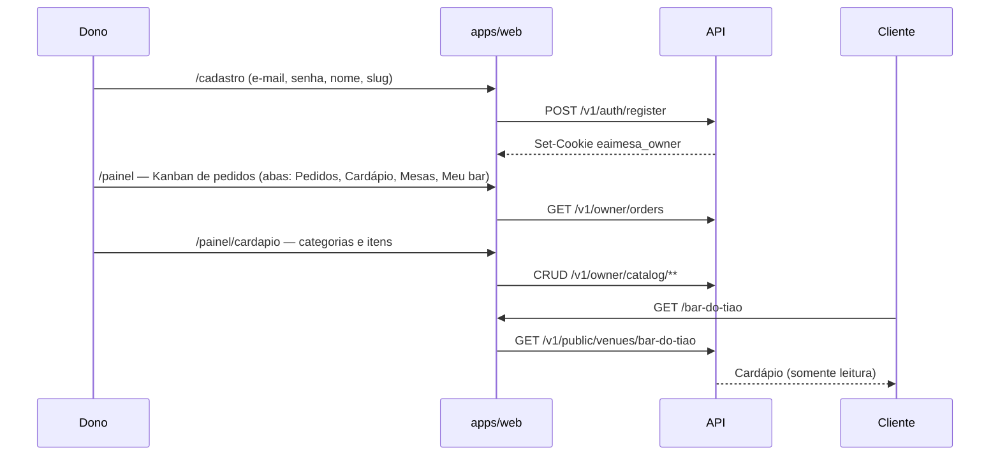
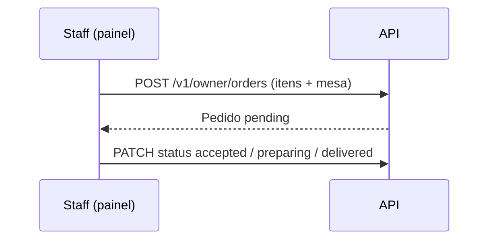
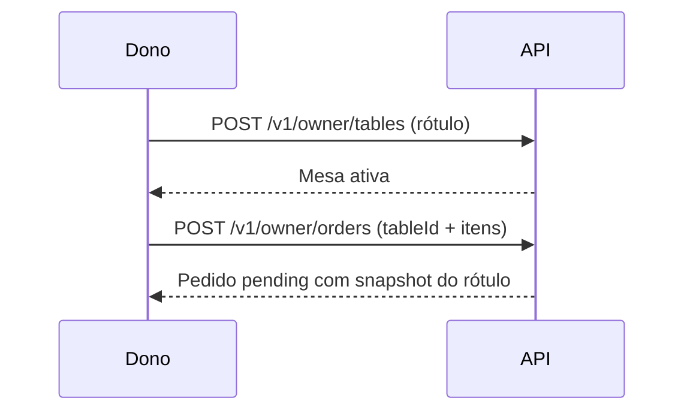
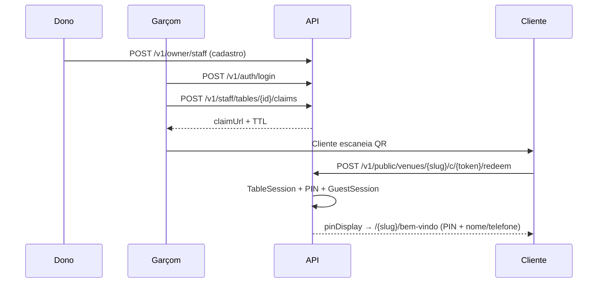
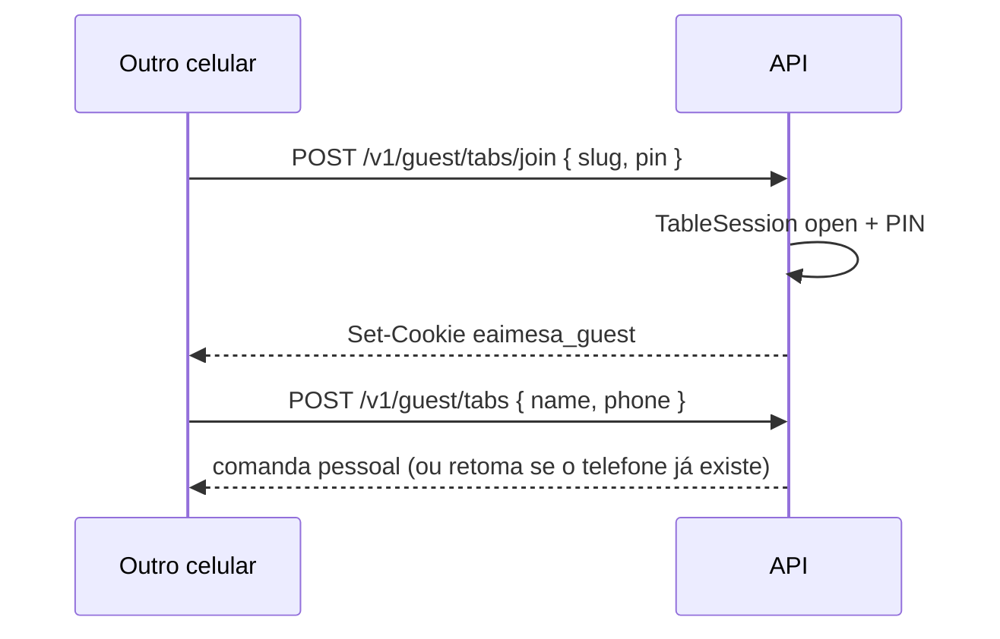

# Fluxos

## 0. Fatia 1 — publicar e ler o cardápio

Detalhe em [fatia-01-cardapio.md](fatia-01-cardapio.md).

1. Dono cria conta + venue (nome + slug único).
2. Monta categorias e itens (preço em centavos no servidor).
3. Comparte `https://eaimesa.com.br/{slug}` (QR fixo na mesa, Instagram, balcão) — **só cardápio**.
4. Cliente abre `/{slug}`: navega por **grupos**, toca o item para ver **foto** e descrição. **Não pede pelo link** (comanda exige QR do garçom). Pedidos de balcão: `/painel/pedidos`. Mesas + export do QR fixo: `/painel/mesas`.

## 0b. Fatia 2 — fila Kanban (balcão)

Detalhe em [fatia-02-pedidos.md](fatia-02-pedidos.md). O cliente **ainda não** pede pelo slug.

1. Staff entra (`/login`) e cai em `/painel/pedidos` (ou clica a aba **Pedidos**).
2. Lança pedido de balcão (escolhe a **mesa** cadastrada) ou vê os do seed.
3. Avança o card nas colunas até **Entregues**.

## 0c. Fatia 3 — cadastrar o salão

Detalhe em [fatia-03-mesas.md](fatia-03-mesas.md). Claim por mesa continua **fora**.

1. Dono abre **Mesas** e cadastra até 15 ativas (ex. Balcão, Mesa 1…10).
2. Exporta o **QR fixo** de cada mesa (destino: cardápio `/{slug}`) e cola no salão.
3. No Kanban, o pedido de balcão escolhe uma mesa ativa.
4. QR/claim do **garçom** (abre comanda): garçom em `/garcom` ou dono autenticado — fatia 4.

## 1. Onboarding do bar (B2B)

1. Dono cria conta (e-mail + senha).
2. Cadastra venue: nome e **slug** (`bar-do-tiao`). CNPJ, CPF responsável e OTP entram em fatia posterior.
3. Escolhe plano Bar; gateway marca `subscription_status = active` (fatia billing). Na fatia 1 o seed/cadastro fica em `trial`.
4. Sistema gera `public_id` opaco interno; a URL pública é o slug.
5. Dono cadastra cardápio (fatia 1), fila (fatia 2) e mesas (fatia 3).
6. Divulga `/{slug}` — **não** o claim.

## 2. Abertura da mesa (garçom → cliente)

1. Dono cadastra garçons em **Equipe** (`/painel/equipe`).
2. Garçom entra em `/login` → `/garcom`, escolhe mesa, mostra QR (countdown ~3 min).
3. Cliente escaneia → redeem → PIN da mesa + **nome e telefone** (comanda pessoal).
4. Pedido pelo cardápio exige comanda pessoal aberta (fatia seguinte).

## 3. Outros celulares na mesa (fatia 5)

Detalhe em [fatia-05-pin-join.md](fatia-05-pin-join.md).

1. Cliente abre `/{slug}` (QR fixo) ou `/{slug}/entrar`.
2. Informa o PIN de 4 dígitos da **mesa**.
3. Nome + telefone → comanda pessoal na mesma ocupação.
4. Garçom **não** precisa voltar.

## 4. Pedido

*Fatia futura (carrinho guest).* Pedidos que existirem gravam `tab_id` da comanda pessoal.

## 5. Fechamento (fatia 6)

Detalhe em [fatia-06-comandas-individuais.md](fatia-06-comandas-individuais.md).

1. Staff: `POST /v1/staff/tabs/{id}/close` — fecha **uma** comanda (revoga sessões daquela conta).
2. Staff: `POST /v1/staff/tables/{id}/close` — encerra a **mesa** só se todas as comandas estão `closed`.
3. Próxima rodada na mesa = novo claim (novo PIN).

## 6. Venue suspenso (billing)

- `GET /{slug}` → cardápio + aviso “assinatura inativa”.
- `POST /guest/orders` → **402/403**.
- Tabs abertas ainda podem **fechar**.

Na fatia 1, `suspended` ainda mostra o cardápio (read-only) com aviso, se o status estiver setado.

## Estados da Tab

| Estado | Guest | Staff |
|--------|-------|-------|
| `open` | Comanda da pessoa | Parcial no dialog da mesa |
| `closed` | Precisa de nova comanda | Arquivo; mesa só encerra se todas closed |

## Impressora (fase 2)

Após `accepted`, job `print_pending` para agente local do venue. Falha de print **não** cancela pedido — fila na tela permanece.
